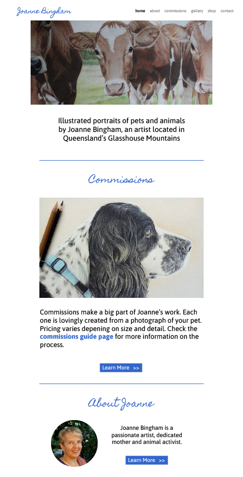

### What we started with

When Joanne approached us, she was using a default template from Wordpress, set up and managed by her husband. She wasn't a fan of the theme colours, and wanted something fresh and bright.

Joanne also had no brand presence. There was no logo or cohesive fonts or colours being used across her marketing. We wanted to create a wordmark logo that better represented her artistic talents.

### Branding and Web Presence

For Joanne, we took a slightly unconventional approach, showing her different combinations of branding options and homepage layouts. Joanne already has design and art experience, and we wanted her to feel creatively involved in the entire process.

Our initial focus was on her portfolio, so Joanne could showcase her work at markets and festivals. She also needed her Instagram account integrated into the homepage, as this is where she was currently sharing a majority of her illustrations.

We chose to build her site on Wordpress as she was somewhat familiar with the platform, and provided one-on-one training so she could add her own blog posts and create custom image galleries. The Wordpress editor is easy to use and provided a clean interface for Joanne to write in.

### Ongoing Support

With no web management experience, Joanne asked that we provide maintenance and hosting for her website. We also included weekly backups, just in case she made an error editing and wanted to roll back.

### Adding a shop

About one year after the initial website rebuild, Joanne requested a custom homepage for her shopfront. She had begun making earrings and also wanted to sell these in the same online shop. Because we already had strong visual rules for her website, designing and building a new shopfront was a quick task. We also provided Joanne with some additional training on adding multiple types of products into the same WooCommerce shop.

